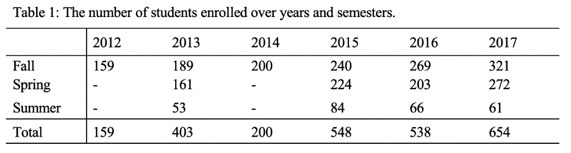
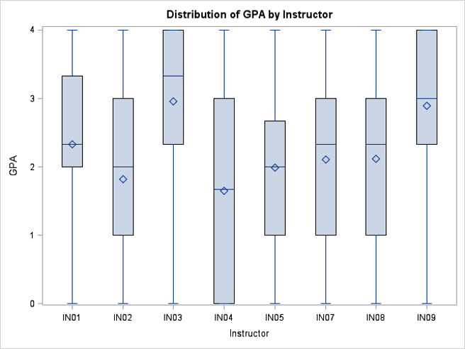

### Characterize Students’ Statistic Course Score
### Objective:
Characterize statistic course enrollment, such as the types of students who take this course and the grade distribution across multiple sections (instructors), semesters, and years. Specific interest is in how enrollment, types students, and grade distributions have changed over time.

### Data:
There are three excel files, two excel named Grades A and B represent the grades for students who took this statistic course in various years and semesters, and the another data set contained sufficient information such as  college/school information, instructor, days, and times information.
There were 2594 students who took the course STAT344 from 2012 to 2017 and they were come from seven different schools/colleges and forty-one different majors. 
### Methodology:
1) Explorary Data Analysis: preformed data cleaning and validation, and merged students'grades and course information into a single dataset.
2) Used t-test and Analysis of Variance (ANOVA) to study how different factors (semester, instructors) affect the final course grade.
### Results:
Our team found that enrollment grows slightly every year, which indicates that more students are beginning to be interested in statistics, especially for the students who are from the Volgenau School of Engineering with Bioengineering major, Computer Science major, and other science related major.

We noticed that a lot of students who have not make decision on major tend to take this statistic course. At a 10% significant level, a significant difference between the grade distributions for students and some related factors including the different major, different instructors, school/college, and different semesters.

More figures would be found in the file named 'figure' which would be able to support the result. The file named 'enrollment and grade analysis' contained the code.

